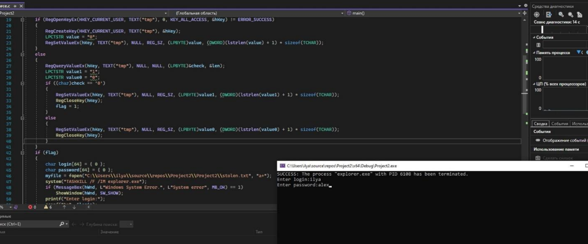
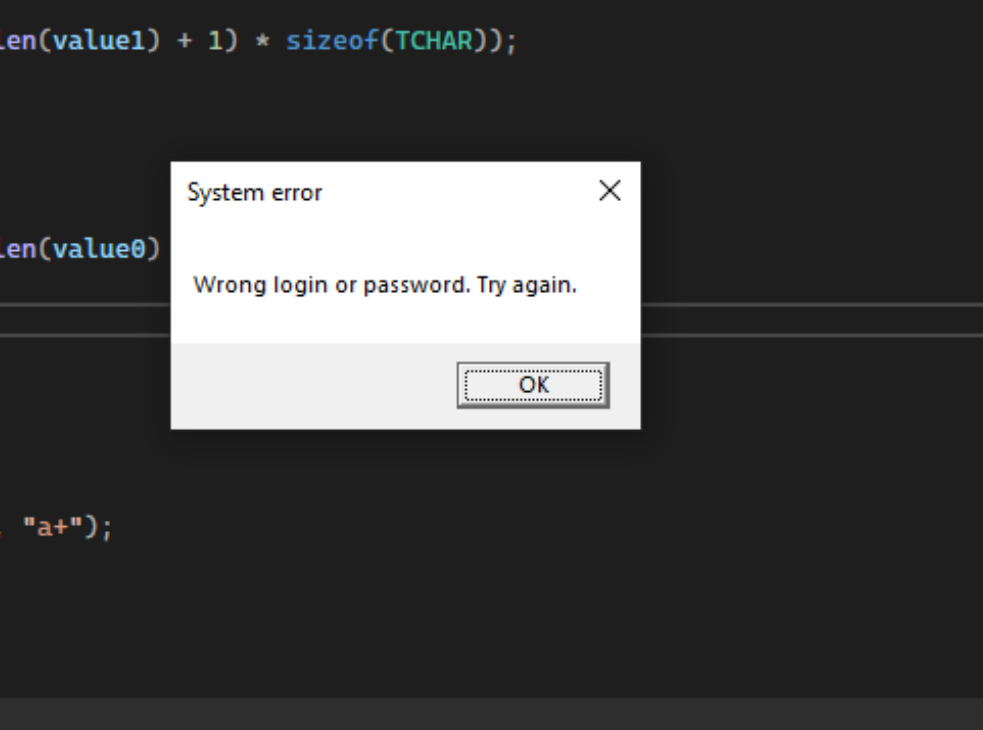
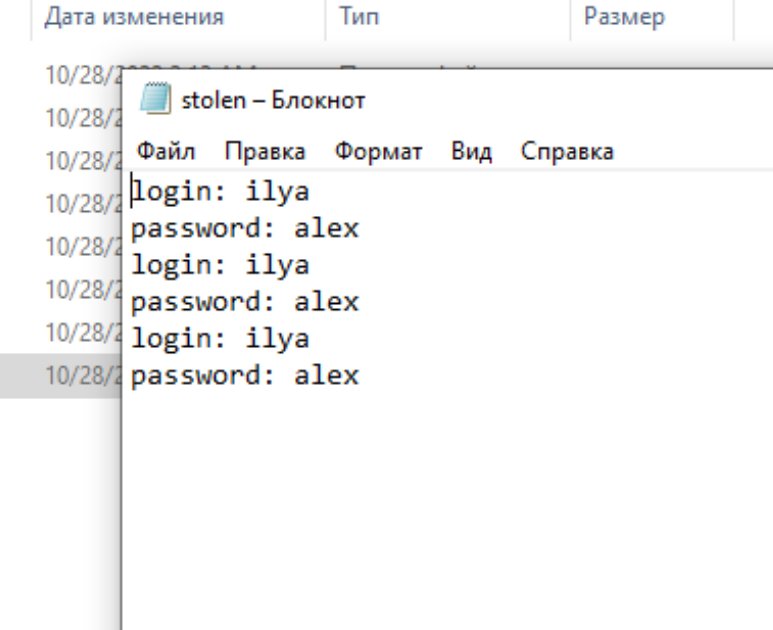
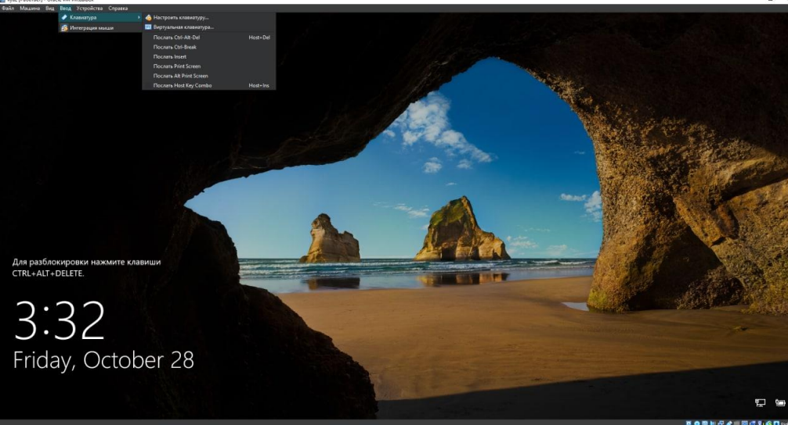

# Программа-имитатор механизма аутентификации пользователей

## Порядок работы программы-имитатора

### При запуске операционной системы пользователь видит окно аутентификации

### После успешного входа запускается программа-имитатор и выдаёт сообщение об ошибке

### После чего просит пользователя снова ввести данные

### Затем программа выдаёт ошибку, закрывается и управление переходит на стандартный вход в систему

### Введённый пользователем пароль сохраняется в текстовый документ, а сам пользователь снова входит в систему

### Во избежание подобных случаев, в Windows есть система, называемая “доверенным путём”. Таким образом, при каждом входе в систему пользователь минует различные вредоносные программы.

